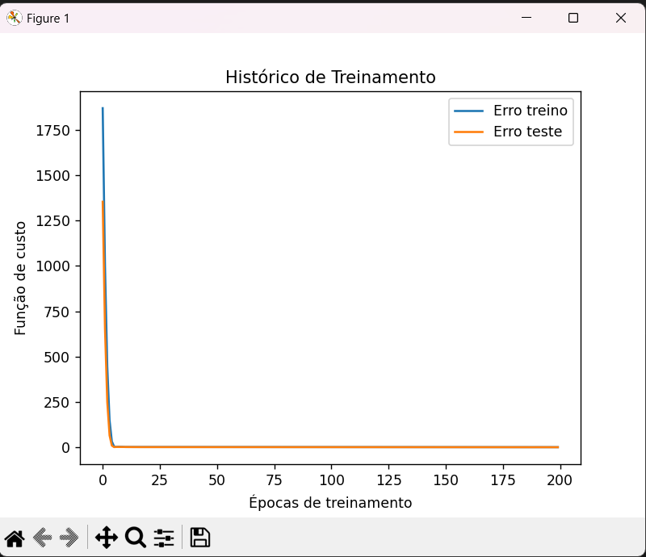

# Redes neurais with Keras

This project simulates the calculation of possible approved students, 
based on some data, finding the probability of a student being admitted

# Libs

- Pandas
- Pyplot
- keras models
- keras layers

# Training

